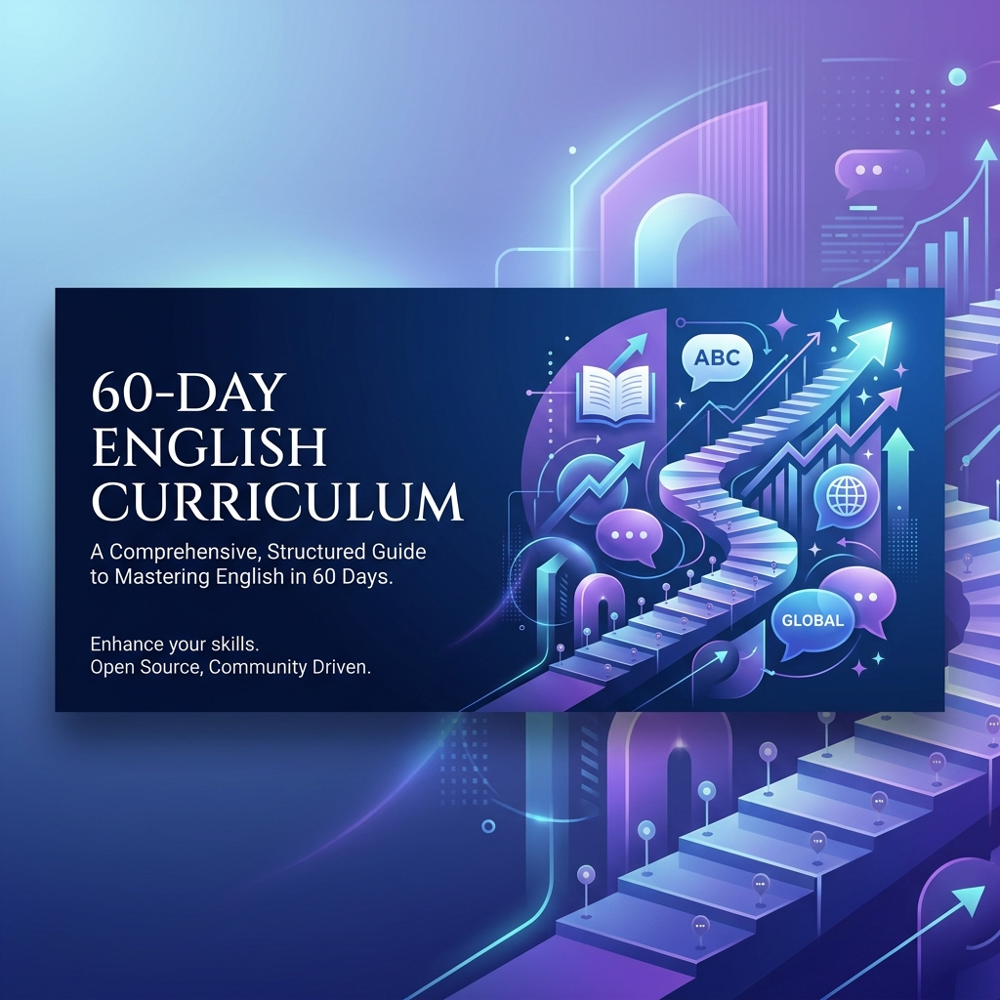
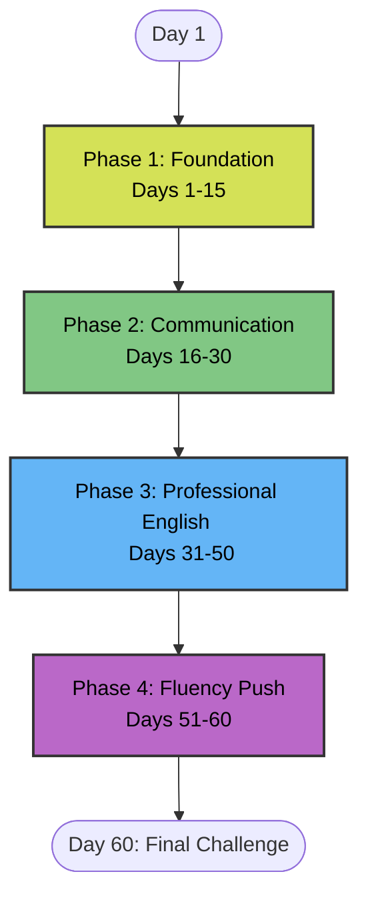
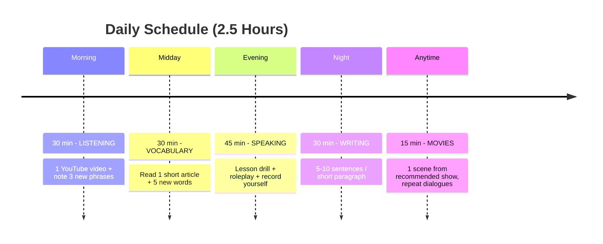

  

  # 60-Day English Curriculum for Hindi Speakers 🇮🇳

  *A free, structured 60-day English learning curriculum designed for Hindi-speaking beginner/intermediate learners who want functional English for daily life and professional/office communication.*

  
  

> Built for people who want to *use* English confidently — in meetings, emails, conversations, and daily life — not pass a grammar exam.

---

## 🌟 Why This Curriculum?

- **Tailored for Hindi Speakers**: Explanations draw natural comparisons to Hindi to help you understand concepts faster.
- **Office & Professional Use**: Learn to communicate effectively in a corporate environment.
- **Practical over Theoretical**: Focuses on what you actually need, skipping unnecessary grammar rules.
- **Comprehensive Daily Routine**: Blends listening, reading, writing, and speaking every single day.

---

## 🏗 System Architecture & Curriculum Flow

---

## ⏰ Daily Workflow

To succeed, you should dedicate about **2.5 hours per day**. Here is the recommended workflow:

---

## 🚀 How to Use This

1. **Clone or Bookmark**: Clone this repository or star/bookmark it for easy access.
2. **Start at Day 1**: Navigate to [Day 1](Day_01_Sentence_Structure/README.md) and follow the instructions.
3. **Be Consistent**: Each day has a lesson, practice exercises, and a speaking task.
4. **Grammar References**: Use the [Grammar References](#-grammar-references) as deep-dive chapters when needed.
5. **Never Skip Speaking**: Speaking practice is included every single day. It's the key to your success!

---

## 📅 60-Day Roadmap

<b>🟢 Phase 1: Foundation (Days 1–15)</b>

 

| Day | Topic | Key Lesson |
|-----|-------|------------|
| [Day 1](Day_01_Sentence_Structure/README.md) | Sentence Structure | S + V + O — verb always comes second |
| [Day 2](Day_02_Verbs/README.md) | Verbs | Be verbs, action verbs, helper verbs |
| [Day 3](Day_03_Present_Tense/README.md) | Present Tense | Simple (habit) vs Continuous (right now) |
| [Day 4](Day_04_Past_Tense/README.md) | Past Tense | V2 forms + Past Continuous |
| [Day 5](Day_05_Future_Tense/README.md) | Future Tense | Will / Going to / Present Continuous |
| [Day 6](Day_06_Questions/README.md) | Questions | Yes/No and WH question formation |
| [Day 7](Day_07_Week1_Revision/README.md) | Week 1 Revision | Mock session + self-assessment |
| [Day 8](Day_08_Modal_Verbs/README.md) | Modal Verbs | Polite requests — can, could, should, would |
| [Day 9](Day_09_Articles/README.md) | Articles | A / An / The — the tiny words that matter |
| [Day 10](Day_10_Prepositions/README.md) | Prepositions | In, On, At, For, With, To |
| [Day 11](Day_11_Conjunctions/README.md) | Conjunctions | Connecting sentences naturally |
| [Day 12](Day_12_Pronunciation/README.md) | Pronunciation | TH sound, V vs W, word stress |
| [Day 13](Day_13_Vocabulary_Strategy/README.md) | Vocabulary Strategy | The POWER method + word families |
| [Day 14](Day_14_Reading_Confidence/README.md) | Reading Confidence | Chunking + context clues + summarizing |
| [Day 15](Day_15_Phase1_Assessment/README.md) | Phase 1 Assessment | Self-test + speaking evaluation |

<b>🔵 Phase 2: Communication (Days 16–30)</b>

 

| Day | Topic | Key Lesson |
|-----|-------|------------|
| [Day 16](Day_16_Listening_Skills/README.md) | Listening Skills | 3-step method + connected speech |
| [Day 17](Day_17_Speaking_Drills/README.md) | Speaking Drills | 4 drills to build fluency fast |
| [Day 18](Day_18_Daily_Phrases/README.md) | Daily Phrases | 50 must-know everyday phrases |
| [Day 19](Day_19_Office_Vocabulary/README.md) | Office Vocabulary | 20 essential office terms |
| [Day 20](Day_20_Pronunciation_Practice/README.md) | Pronunciation Practice | 5 common errors + how to fix them |
| [Day 21](Day_21_Week3_Revision/README.md) | Week 3 Revision | Listening + speaking review |
| [Day 22](Day_22_Conversation_Topics/README.md) | Conversation Topics | 5 key areas to speak about |
| [Day 23](Day_23_Most_Used_Phrases/README.md) | Most-Used Phrases | Office phrases in context |
| [Day 24](Day_24_Daily_Journal/README.md) | Daily Journal | Writing 100 words a day in English |
| [Day 25](Day_25_Mock_Conversations/README.md) | Mock Conversations | 3 ways to practice without a partner |
| [Day 26](Day_26_Advanced_Introduction/README.md) | Advanced Introduction | 3 versions — 30 sec, 2 min, email |
| [Day 27](Day_27_Describing_Work/README.md) | Describing Work | STAR format for work stories |
| [Day 28](Day_28_Week4_Revision/README.md) | Week 4 Revision | Conversation confidence check |
| [Day 29](Day_29_Presentation_Basics/README.md) | Presentation Basics | Opening, body, closing, Q&A |
| [Day 30](Day_30_Mid_Course_Review/README.md) | Mid-Course Review | Day 30 progress video |

<b>🟣 Phase 3: Professional English (Days 31–50)</b>

 

| Day | Topic | Speaking Challenge |
|-----|-------|-------------------|
| [Day 31](Day_31_Speaking_Challenge/README.md) | Speaking Challenges Begin | Record a 2-min introduction video |
| [Day 32](Day_32_Phone_Conversations/README.md) | Phone Conversations | Call a friend in English for 5 min |
| [Day 33](Day_33_Describing_Commute/README.md) | Describing Experiences | Describe your commute (voice note) |
| [Day 34](Day_34_News_Summarizing/README.md) | News Summarizing | Summarize an article out loud |
| [Day 35](Day_35_Meeting_Roleplay/README.md) | Meeting Roleplay | Explain being late to a meeting |
| [Day 36](Day_36_Email_Writing/README.md) | Email Writing | Write 3 professional emails |
| [Day 37](Day_37_Movie_Opinions/README.md) | Expressing Opinions | Give a movie review (2 min) |
| [Day 38](Day_38_Time_Off_Request/README.md) | Making Work Requests | Ask your manager for a day off |
| [Day 39](Day_39_Ideal_Workplace/README.md) | Describing Preferences | Describe your ideal workplace |
| [Day 40](Day_40_Shadowing_Practice/README.md) | Shadowing Technique | Shadow a 1-min YouTube clip |
| [Day 41](Day_41_Describe_Your_Job/README.md) | Explain Your Job | Explain your role to a stranger |
| [Day 42](Day_42_Mock_Team_Meeting/README.md) | Mock Team Meeting | Lead a 3-min mock team meeting |
| [Day 43](Day_43_Problem_Solving_Talk/README.md) | Problem-Solution Talk | Describe a problem you solved |
| [Day 44](Day_44_Customer_Calls/README.md) | Customer Calls | Call a shop and ask in English |
| [Day 45](Day_45_Photo_Description/README.md) | Photo Description | Describe a photo for 90 seconds |
| [Day 46](Day_46_Giving_Feedback/README.md) | Giving Feedback | Give a colleague feedback (2 min) |
| [Day 47](Day_47_Reading_Aloud/README.md) | Reading Aloud | Read a paragraph, record and review |
| [Day 48](Day_48_TED_Style_Talk/README.md) | TED-Style Talk | Give a 2-min talk on any topic |
| [Day 49](Day_49_Deadline_Negotiation/README.md) | Deadline Negotiation | Negotiate a deadline with your manager |
| [Day 50](Day_50_Professional_Video/README.md) | Professional Video | Record a 3-min "About Me" video |

<b>🟠 Phase 4: Fluency Push (Days 51–60)</b>

 

| Day | Topic | Speaking Challenge |
|-----|-------|-------------------|
| [Day 51](Day_51_Difficult_Questions/README.md) | Difficult Questions | Handle tough questions in a meeting |
| [Day 52](Day_52_Video_Summary/README.md) | Advanced Summarizing | Summarize a YouTube video |
| [Day 53](Day_53_Career_Planning/README.md) | Career Goals | Speak about your 5-year plan |
| [Day 54](Day_54_Welcoming_Colleagues/README.md) | Welcoming Colleagues | Welcome a new team member |
| [Day 55](Day_55_Current_Topics/README.md) | Current Topics | Give your opinion on a work/tech topic |
| [Day 56](Day_56_Mock_Presentation/README.md) | Mock Presentation | Record a 4-min presentation |
| [Day 57](Day_57_Job_Interview/README.md) | Job Interview | Full mock job interview |
| [Day 58](Day_58_Extended_Conversation/README.md) | Extended Conversation | Speak for 10 minutes non-stop |
| [Day 59](Day_59_Professional_Introduction/README.md) | Professional Introduction | Write + speak your polished intro |
| [Day 60](Day_60_Final_Challenge/README.md) | **FINAL CHALLENGE** | 5-min video: Who am I, what do I do, what are my plans? |

---

## 📚 Grammar References

Deep-dive chapters for when you need more detail:

- [Modal Verbs](grammar/modal-verbs.md) — can, could, will, would, should, must, may, might, need to
- [V2 Verb Forms](grammar/v2-verb-forms.md) — 75 essential past-tense verbs grouped by pattern, with a 7-day study plan

---

## ✅ Success Checklist (Day 60 Goals)

- [ ] Introduce yourself naturally in English
- [ ] Write a professional email without major errors
- [ ] Ask and answer questions in a meeting
- [ ] Hold a 5-minute conversation
- [ ] Understand 70% of English YouTube videos
- [ ] Describe your work, ideas, and opinions clearly
- [ ] Think in English for at least 30 minutes per day
- [ ] No longer translate from Hindi before every sentence

---

## 🤝 Contributing

This project is open for contributions! We'd love your help to make it better.

- **Found an error?** Open an issue.
- **Want to add grammar chapters?** (prepositions, articles, conditionals)? See [CONTRIBUTING.md](CONTRIBUTING.md).
- **Translation:** Want to translate this for Tamil, Bengali, Telugu, or Marathi speakers? Open a discussion first.
- **Content:** Want to add exercises, vocabulary lists, or practice scripts? PRs are always welcome.

---

## 📄 License

This curriculum is distributed under the [CC BY-SA 4.0](LICENSE) License — free to use, share, and adapt, even commercially, with credit and the same license on adaptations.

---

  
English sikhne ka ek hi rule hai:

  <h3>"Every day. A little. Consistently."</h3>
  
Start at <a href="Day_01_Sentence_Structure/README.md">Day 1</a>. Don't skip. Progress, not perfection.

